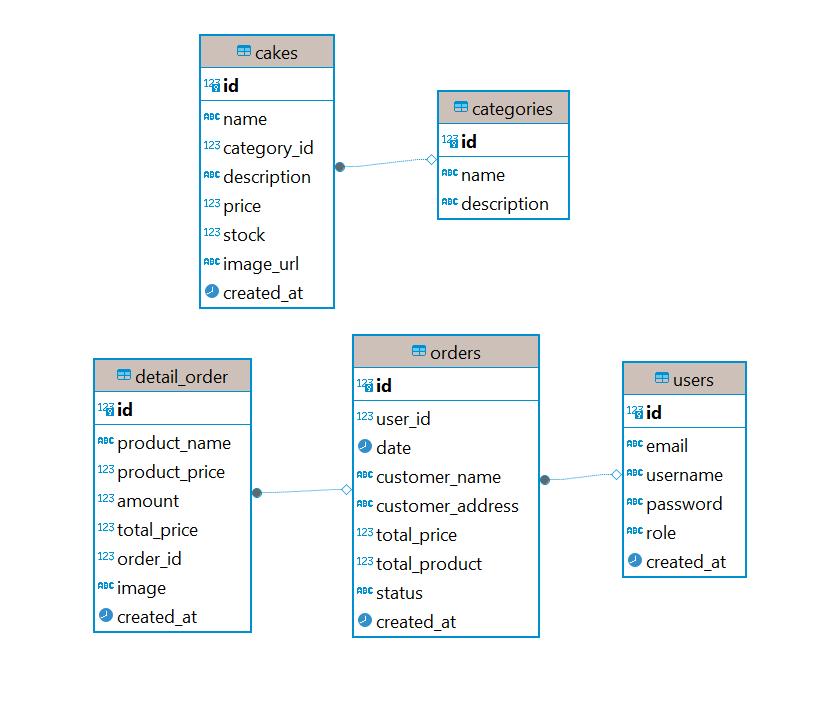

# Ann's Bakery

**Ann's Bakery** adalah sebuah aplikasi web untuk toko kue yang mempermudah pengguna untuk melihat dan memesan berbagai jenis kue. Aplikasi ini juga menyediakan informasi tentang berbagai jenis kue yang dijual, termasuk gambar, harga, dan ketersediaan stok.

## Fitur

- **Penampilan Produk**: Pengguna dapat melihat daftar produk kue yang tersedia beserta nama, gambar, harga, dan ketersediaan stok.
- **Pencarian Produk**: Pengguna dapat mencari produk kue berdasarkan nama untuk menemukan kue yang diinginkan dengan cepat.
- **Pengurutan Produk**: Pengguna dapat mengurutkan produk berdasarkan ID, nama, atau harga dalam urutan naik atau turun.
- **Pemesanan**: Pengguna dapat memesan produk kue yang mereka inginkan dengan mudah.
- **Keranjang Belanja**: Pengguna dapat menambahkan produk ke keranjang belanja dan melihat total harga sebelum checkout.
- **Pembayaran**: Pengguna dapat melakukan pembayaran untuk pesanan mereka secara online.
- **Upload Bukti Transfer**: Pengguna dapat mengunggah bukti transfer sebagai konfirmasi pembayaran.
- **Manajemen Stok**: Admin memiliki akses khusus untuk menambahkan, mengedit, dan menghapus produk kue, serta mengelola stok.
- **Riwayat Pesanan**: Admin dan pengguna dapat melihat riwayat pesanan yang telah dilakukan, termasuk detail pesanan.
- **Login dan Registrasi**: Pengguna harus mendaftar dan masuk untuk dapat melakukan pemesanan dan melihat riwayat pesanan.

## Entity Relationship Diagram (ERD)

## Teknologi yang Digunakan
- **Frontend**: React.js, Tailwind CSS, CSS
- **Backend**: Node.js, Express.js
- **Database**: PostgreSQL
- **Version Control**: Git, GitHub

